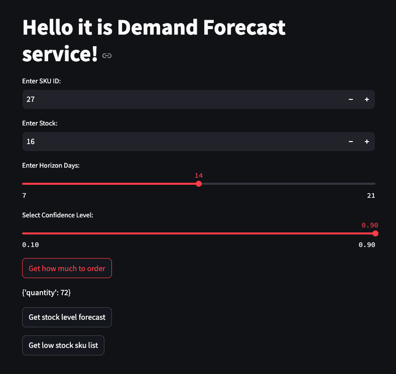

# Demand Forecast
Demand forecasting and stock management are critical challenges for modern marketplaces. This project implements a demand forecasting model using quantile regression to optimize stock levels. 
I developed a FastAPI service for inventory management and integrated the model training and inference pipelines with the MLOps tool, ClearML. Additionally, I created a web interface using Streamlit for easy interaction and visualization of key features like stock forecasts, reorder quantities, and low-stock SKU alerts.

## Usage

```
pip install -r requirements.txt
```

### Service

Run the application by FastAPI:
```
python src/app.py
```

Run the application by Streamlit:
```
streamlit run web_app/streamlit_app.py
```

Visit http://localhost:5000/docs and upload data/processed/predictions.csv:



For example, you would like to know the demand for the product with sku id 27 for the next 14 days. You should fill in the fields in web service: SKU_ID = 27, Stock = 16, Horizon Days = 14, Confidence Level = 0.90
Сlick the buttons: 
- "Get how much to order" to find out how much diawara you need to order from the supplier. 
- "Get stock level" to find out how much stock you will have in 14 days. 
- "Get low stock sku id" to find out which products will be out of stock in 14 days.


### Pipelines

Before running the pipelines, execute the following command in the project directory:
```
export PYTHONPATH=$PWD
```

To get sales forecasts, we need to first train the model and then make predictions for the next 1, 2, or 3 weeks. This results in two main components:

- **Training Pipeline**: gathers data (the entire history), generates features, trains the model, and evaluates its performance.
- **Inference Pipeline**: collects the latest data, generates features, and makes predictions using the already trained model.

To quickly run the pipeline, use the debug mode:
```
python training.py --debug True
python inference.py --debug True
```

## Project Organization
------------

```

├── README.md
├── data
│   ├── get_data.sql
│   ├── processed   <--- The final, canonical data sets for modeling
│   │   └── predictions.csv
│   └── raw     <--- The original, immutable data dump
│       ├── demand_orders.csv   <--- Raw data about orders
│       ├── sales.csv   <--- Raw aggregated data about orders
│       └── sales_with_features.csv
├── images
├── models              <--- Trained models
│   └── model.pkl
├── notebooks
│   └── EDA.ipynb
├── requirements.txt
├── src
│   ├── app.py          <--- FastAPI app
│   ├── evaluate.py     <--- Evaluating model performance
│   ├── features.py     <--- Adding features to sales.csv
│   ├── inference.py    <--- ClearML pipeline for predicting
│   ├── model.py        <--- Class for fitting and prediction
│   └── training.py     <--- ClearML pipeline for model training
└── web_app
    └── streamlit_app.py    <--- Streamlit app
```

------------

